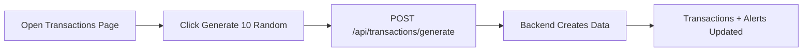

# Dummy Dataset Generation Guide

This guide explains how to generate dummy transaction data for testing and demonstration purposes.

The system provides two ways to generate sample transactions:

1. Using the Backend API
2. Using the Frontend Dashboard

---

# Method 1 — Generate Dataset Using Backend API

## API Endpoint

```

POST /api/transactions/generate

```

This endpoint creates random transaction records and processes them through the complete transaction monitoring pipeline.

The generated transactions will:

- Be stored in the `transactions` table
- Be evaluated against all active monitoring rules
- Generate alerts if any rules are triggered

---

## Request

### URL

```

[http://localhost:8080/api/transactions/generate](http://localhost:8080/api/transactions/generate)

```

### Method

```

POST

````

### Request Body

```json
{
  "count": 10
}
````

Where:

| Parameter | Description                              |
| --------- | ---------------------------------------- |
| count     | Number of dummy transactions to generate |

---

## Example API Request

Using cURL:

```bash
curl -X POST http://localhost:8080/api/transactions/generate \
-H "Content-Type: application/json" \
-d '{"count":10}'
```

---


---

# Method 2 — Generate Dataset Using Frontend

## Steps

1. Open the application frontend:

```
http://localhost:5173
```

2. Navigate to:

```
Transactions Tab
```

3. Click:

```
⚡ Generate 10 Random
```

4. The system will automatically create 10 dummy transactions.

---

## Frontend Flow



---

# Generated Dataset Behaviour

Each generated transaction contains:

| Field            | Example       |
| ---------------- | ------------- |
| Account ID       | ACC-001       |
| Payee ID         | PAYEE-NEW-1   |
| Amount           | Random amount |
| Transaction Type | DEBIT/CREDIT  |
| Status           | COMPLETED     |
| Timestamp        | Current time  |

---

# Rule Evaluation During Generation

Every generated transaction is automatically checked against active monitoring rules.

Example:

| Transaction                   | Rule Triggered   | Result       |
| ----------------------------- | ---------------- | ------------ |
| Amount > $10,000              | High Value Rule  | HIGH Alert   |
| First transaction to payee    | New Payee Rule   | LOW Alert    |
| Multiple transactions quickly | Velocity Rule    | MEDIUM Alert |
| Daily spending exceeds limit  | Daily Limit Rule | HIGH Alert   |

---

# Verify Generated Data

After generation:

## Transactions Page

Check:

```
Transactions → Recent Transactions
```

You should see newly created records.

---

## Alerts Page

Navigate:

```
Alerts
```

Generated suspicious transactions will appear as alerts.

---

## Dashboard

The dashboard will update:

* Total alerts
* Open alerts
* Alerts generated today
* Recent alert activity

---

# Notes

* Generated transactions use the same processing flow as real transactions.
* Every transaction goes through the rule engine.
* Alerts are created only when configured monitoring rules are triggered.
* The dataset is intended for development, testing, and demonstrations.

```

