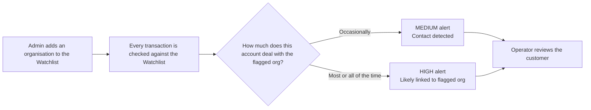
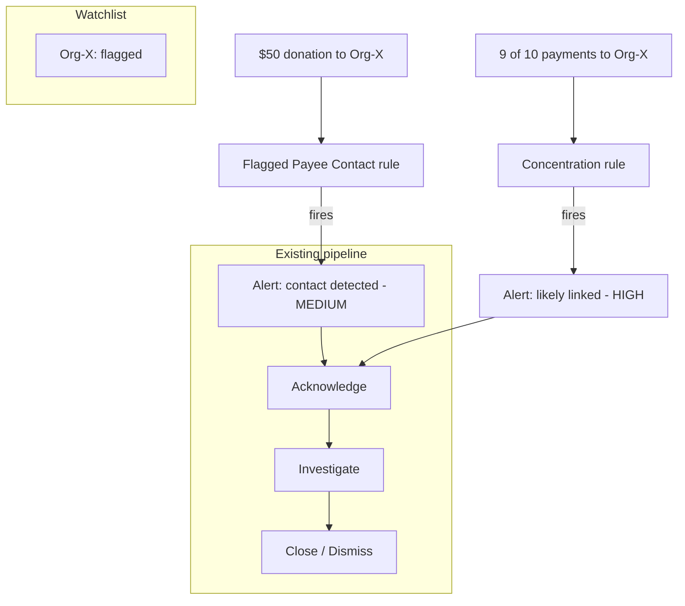

# Feature Proposal: Flagged Organisation Monitoring

> Detect customers who send money to anti-social organisations and identify the organisations themselves.

---

## 1. The Two Scenarios We Must Catch

| | Scenario A — "The Occasional Donor" | Scenario B — "The Front Organisation" |
|---|---|---|
| **Who** | A normal customer | An account set up around the organisation |
| **Behaviour** | Spends normally (groceries, rent, shopping) but sends a donation to an anti-social organisation once in a while | Almost all money flows towards the flagged organisation |
| **Example** | Buys groceries all month, sends $50 to Org-X every few months | 9 of 10 transactions go to Org-X |
| **What we want to do** | Flag the *contact* so the operator can check whether the customer is knowingly funding it (MEDIUM) | Flag the *account* as likely linked to the organisation for deep investigation (HIGH) |

---

## 2. The Idea — One Simple Concept

Keep a **Watchlist of flagged organisations** (beneficiaries/payees). From the moment an organisation is on the watchlist, every new transaction is checked against it — and two things can happen:



This reuses the system's **existing** alert workflow — every alert follows the same Open → Acknowledge → Investigate → Close lifecycle with a full audit trail.

---

## 3. What We Add (Small, Fits the Current System)

Two new monitoring rules, managed exactly like the existing ones (e.g. "amount > $10,000", "5 transactions in 10 minutes"):

| New Rule | Covers | How it fires | Suggested severity |
|---|---|---|---|
| **Flagged Payee Contact** | Scenario A | Any transaction to an organisation on the watchlist | MEDIUM |
| **Flagged Payee Concentration** | Scenario B | An account's transactions to flagged organisations exceed a set share (e.g. 50–80%) over a period (e.g. last 30 days) | HIGH |

| Area | Today | With this feature |
|---|---|---|
| Data | transactions, rules, alerts | + a `flagged_entities` watchlist table (payee, name, reason, date flagged) |
| Rules | 4 rule types | + 2 new rule types above |
| Rules page | toggle / edit / add rules | + "Flagged Organisations" tab to add and remove watchlist entries |
| Alerts & history | existing lifecycle | unchanged — new alerts flow through the same pipeline |

---

## 4. How It Looks in Action

### Scenario A — Occasional donor

```
Customer buys groceries, pays rent            (normal — no alert)
Customer sends $50 to Org-X (on watchlist)    (MEDIUM alert)
  → Operator: is the customer aware? Warn, watch, or escalate
```

### Scenario B — Front organisation

```
Account Org-Front-001 sends 9 of its last 10 payments to Org-X
  (HIGH concentration alert)
  → Operator: account is likely linked to Org-X → investigate / freeze
```

### Example flow with numbers



---

## 5. Admin Workflow (How an Organisation Gets Flagged)

```
Rules page
   │
   ▼
"Flagged Organisations" tab
   │
   ▼
Add payee ID + name + reason  ──►  organisation is on the watchlist
   │
   ▼
Next transaction to it automatically fires an alert (rules above)
```

Unflagging an organisation works the same way — remove it from the watchlist and no new alerts fire. Historical alerts stay untouched (the system already snapshots alert details at creation time).

---

## 6. Why This Solves Both Scenarios Cleanly

- **One watchlist, two rules** — no special-casing; a single source of truth for who is flagged.
- **Catches the unknowing supporter** (Scenario A) without blocking normal banking.
- **Catches the organisation itself** (Scenario B) via concentration, which a simple blacklist alone would miss.
- **Zero disruption** — reuses the existing rule engine, alert lifecycle, audit trail, and dashboard.
- **Configurable, not hard-coded** — thresholds (share %, time window) can be tuned in the Rules page without code changes.

The **flagging feature** is basically a **watchlist-based monitoring system**. The idea is: instead of only looking at transaction patterns (amount, velocity, daily limits), we also maintain a list of **known risky entities** (organisations/payees), and every transaction is checked against that list.

The goal is **not to block transactions automatically**. It only raises alerts so an analyst can investigate. 

Let's go end-to-end with an example.

---

# Scenario

A bank wants to monitor transactions involving a suspicious organisation:

```
Organisation:
Global Charity X

Payee ID:
ORG-12345

Reason:
Known suspicious organisation

Risk Level:
HIGH
```

The bank adds this organisation to the watchlist.

---

# Step 1: Admin Adds Organisation to Watchlist

From the dashboard:

```
Flagged Organisations

+ Add Organisation


Name:
Global Charity X

Payee ID:
ORG-12345

Reason:
Suspicious funding activity

Risk:
HIGH


Save
```

Database:

### flagged_entities table

| id | name             | payee_id  | reason             | status |
| -- | ---------------- | --------- | ------------------ | ------ |
| 1  | Global Charity X | ORG-12345 | Suspicious funding | ACTIVE |

Now the system knows:

```
Any future transaction involving ORG-12345 needs checking
```

This follows the watchlist approach where an admin adds an organisation and every future transaction is checked against it. 

---

# Step 2: Normal Customer Makes a Transaction

Customer:

```
Account:
ACC-1001

Transaction:

Amount:
$50

Payee:
ORG-12345
```

Flow:

```
Transaction Received

        |
        ↓

Save Transaction

        |
        ↓

Rule Engine Runs

        |
        ↓

Check Active Rules

        |
        ↓

Check Flagged Organisations

```

---

# Step 3: Flagged Organisation Rule Executes

The rule asks:

```
Is transaction.payee_id
present in flagged_entities?
```

Database query:

```sql
SELECT *
FROM flagged_entities
WHERE payee_id='ORG-12345'
AND status='ACTIVE';
```

Result:

```
MATCH FOUND
```

So:

```
Transaction
      |
      |
      ↓
Flagged Payee Rule Triggered
      |
      |
      ↓
Create Alert
```

---

# Step 4: Alert Created

Database:

### alerts table

```
Alert ID:
5001

Rule:
FLAGGED_PAYEE

Account:
ACC-1001

Severity:
MEDIUM

Reason:
Transaction made to flagged organisation

Status:
OPEN
```

The alert enters the normal lifecycle:

```
OPEN
 |
 ↓
ACKNOWLEDGED
 |
 ↓
INVESTIGATING
 |
 ↓
CLOSED / DISMISSED
```

The existing alert workflow can be reused. 

---

# Step 5: Analyst Reviews Alert

Dashboard shows:

```
Alert #5001

Customer:
ACC-1001

Transaction:
$50

Payee:
Global Charity X

Reason:
Customer sent money to flagged organisation

Severity:
MEDIUM
```

Analyst can investigate:

Questions:

* Does the customer know this organisation?
* Is this a one-time donation?
* Is there suspicious behaviour?

---

# Scenario 2: Front Organisation Detection

The problem:

A simple blacklist only catches:

```
Customer → Flagged Organisation
```

But criminals may create accounts specifically to move money.

Example:

Account:

```
ACC-9999
```

Transactions:

```
Day 1:
ACC-9999 → Global Charity X $1000

Day 2:
ACC-9999 → Global Charity X $2000

Day 3:
ACC-9999 → Global Charity X $3000

Day 4:
ACC-9999 → Global Charity X $5000
```

90% of account activity is connected to this organisation.

---

Now a second rule runs:

## Flagged Organisation Concentration Rule

Logic:

```
Calculate:

Money sent to flagged organisations
-----------------------------------
Total account transactions


If percentage > threshold

Generate HIGH alert
```

Example:

```
Total outgoing payments:

$12000


Payments to Global Charity X:

$11000


Percentage:

91%
```

Rule:

```
If flagged organisation percentage > 80%

Generate HIGH alert
```

Result:

```
HIGH ALERT

Reason:
Account has high transaction concentration
with flagged organisation
```

This is the second scenario described as identifying accounts likely linked to the organisation. 

---

# Complete System Flow

```
                 Admin

                   |
                   |

        Add Organisation to Watchlist

                   |
                   |

          flagged_entities table


                   |
                   |

            Customer Transaction

                   |
                   |

              Rule Engine

                   |
        +----------+-----------+
        |                      |
        ↓                      ↓

 Flagged Payee Rule      Concentration Rule


        |                      |

        ↓                      ↓


 MEDIUM Alert             HIGH Alert


        |                      |

        +----------+-----------+

                   |

             Analyst Dashboard

                   |

       Acknowledge / Investigate /
              Close / Dismiss

```

---

# Database Changes Needed

Add:

## flagged_entities

```
id
entity_name
payee_id
reason
risk_level
active
created_at
```

Add new rule types:

```
FLAGGED_PAYEE
FLAGGED_PAYEE_CONCENTRATION
```

The feature proposal suggests exactly this approach: adding a `flagged_entities` watchlist table and two rules while reusing the existing alert pipeline. 

---

# Simple Customer Explanation

> "The flagging feature works like a bank watchlist. If an organisation is marked as suspicious, every future transaction involving that organisation is automatically checked. If a customer interacts with it occasionally, we create a medium-risk alert for review. If an account appears to be primarily used for transactions with that organisation, we create a higher-risk alert because it may indicate a stronger connection. The system does not block transactions automatically; it helps analysts identify and investigate suspicious activity."


---

## 7. Out of Scope for v1 (Future Ideas)

- Matching by fuzzy organisation name (v1 matches on the exact payee ID recorded with each transaction).
- Automatic account freezing (v1 alerts the operator, who decides).
- Cross-account link analysis (e.g. detecting a network of supporters).
